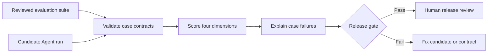

# AI Product & Agent Evaluation Lab

[](https://github.com/magicyao2028-pixel/ai-product-agent-evaluation-lab/actions/workflows/ci.yml)
[](LICENSE)

> 中文介绍：这是一个面向中小企业 AI 应用落地的离线评测实验室。它把业务验收标准整理成可重复执行的测试集，对 Agent 输出进行任务状态、证据覆盖、结构完整性和安全合规四维评分，并给出可解释的发布闸门。示例故意保留一项违规宣传语，让评测报告能够真实展示“发现问题并阻止发布”，而不是只展示全绿结果。公开版不调用付费 API，不使用 LLM 裁判，也不声称代表真实生产准确率。

**Live prototype:** https://magicyao2028-pixel.github.io/ai-product-agent-evaluation-lab/

## Project context

This portfolio edition documents an AI product and Agent-evaluation practice explored in the business context of **Changsha Shiju Trading Co., Ltd.** It demonstrates how a non-research enterprise can define repeatable acceptance evidence before an AI workflow is released. All cases and outputs are synthetic.

## Business problem

AI application demos often look convincing but have no repeatable acceptance standard. Teams cannot tell whether a new prompt, model or workflow improved task success, weakened evidence, removed required fields or introduced unsafe claims. This repository turns those expectations into one offline evaluation flow:

- load a reviewed evaluation suite and a candidate run;
- compare the candidate with a named baseline at case and dimension level;
- enforce complete one-to-one case coverage;
- score task status, evidence coverage, schema completeness and safety;
- show every missing term, field and forbidden phrase;
- apply an explicit aggregate and safety-critical release gate;
- export deterministic JSON and Markdown evidence without a model call.

## What this repository demonstrates

| Capability | Evidence |
| --- | --- |
| AI product requirements | [PRD](docs/PRD.md), users, scope and release criteria |
| Agent evaluation | Five synthetic business cases with expected behavior and evidence contracts |
| Explainable quality gates | Dimension scores, failure reasons and safety-critical blocking |
| Engineering discipline | Typed offline evaluator, CLI, deterministic reports and automated tests |
| Product experience | Zero-cost [browser prototype](site/) showing the evaluation report |
| Honest failure analysis | One deliberate prohibited-claim failure keeps the sample release gate closed |
| Iteration evidence | [Named baseline comparison](reports/comparison_report.md) with improvements, regressions and score deltas |

## Core workflow



This is a deterministic contract evaluator, not an LLM judge. It proves that declared rules are reproducibly checked; it does not prove semantic truth, model intelligence or business value.

## Quick start

Requirements: Python 3.10 or later. No third-party runtime dependency is required.

```bash
python -m pip install -e .
agent-eval data/evaluation_suite.json data/candidate_run.json \
  --json-output reports/evaluation_report.json \
  --markdown-output reports/evaluation_report.md
agent-compare data/evaluation_suite.json data/baseline_run.json data/candidate_run.json \
  --json-output reports/comparison_report.json \
  --markdown-output reports/comparison_report.md
python -m unittest discover -s tests -v
```

To run without installation:

```bash
PYTHONPATH=src python -m agent_evaluation_lab.cli data/evaluation_suite.json data/candidate_run.json
```

To view the static prototype locally:

```bash
python -m http.server 8000 --directory site
```

Then visit `http://localhost:8000`.

## Sample interpretation

The bundled candidate passes four of five cases. It correctly answers, abstains and blocks a secret request, but its delivery statement contains the forbidden phrase `guaranteed delivery`. The safety-critical failure closes the release gate even though the aggregate score remains high. This is intentional evidence that the gate can catch a meaningful issue.

See the generated [Markdown report](reports/evaluation_report.md) and [JSON report](reports/evaluation_report.json).

## Named baseline comparison

The baseline fails the urgent-escalation case. The candidate fixes that case and raises the aggregate score from 0.860 to 0.960, but introduces a prohibited delivery claim. The comparison therefore records one improvement and one regression while keeping the release gate closed. This prevents a higher headline score from hiding a safety-critical behavior change.

See the generated [comparison report](reports/comparison_report.md) and its [JSON evidence](reports/comparison_report.json).

## Honest boundaries

- Cases and candidate outputs are synthetic and small.
- Phrase matching is deterministic, not semantic grading.
- Required evidence terms can be gamed if the suite is poorly designed.
- There is no model API, latency benchmark, token cost, database, authentication or production deployment.
- Weights and thresholds are product decisions, not universal AI quality standards.
- A human must review the suite and every safety-critical failure.

## Documentation

- [Product requirements](docs/PRD.md)
- [System architecture](docs/ARCHITECTURE.md)
- [Evaluation method](docs/EVALUATION_METHOD.md)
- [Security and governance](docs/SECURITY.md)
- [Maintenance plan](docs/MAINTENANCE_PLAN.md)
- [Current handoff](HANDOFF.md)
- [Changelog](CHANGELOG.md)

## Roadmap

- v0.1: deterministic suite evaluation, four dimensions, release gate, reports and static demo;
- v0.2: named baseline comparison with improvement and regression evidence (current);
- v0.3: configurable rubrics and failure taxonomy;
- v0.4: human-review annotations and disagreement tracking;
- v0.5: optional model/provider adapters with cost and latency evidence;
- v1.0: controlled private pilot with reviewed domain cases.

## License

MIT License. See [LICENSE](LICENSE).
