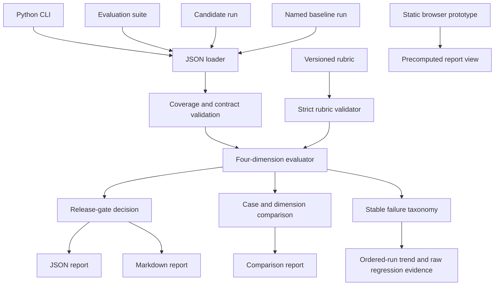

# System Architecture

## v0.4 design goals

- deterministic and reproducible evaluation;
- no paid runtime dependency;
- explainable dimensions and release decisions;
- synthetic public evidence only;
- clear separation between rules and semantic judgment.

## Logical architecture

## Component responsibilities

| Component | Responsibility |
| --- | --- |
| `evaluator.py` | Validate IDs, score cases, apply the gate and serialize reports. |
| `cli.py` | Provide file input and report-output arguments. |
| `comparison.py` | Compare named baseline and candidate reports without hiding regressions in aggregate scores. |
| `comparison_cli.py` | Provide baseline/candidate file input and comparison-report output. |
| `rubric.py` | Validate versioned weights, thresholds, dimension floors and release-gate settings. |
| `taxonomy.py` | Convert deterministic observations and invalid contracts into stable failure codes. |
| `trend.py` | Compare ordered named runs and preserve transition-level regression evidence. |
| `data/` | Store the synthetic suite, named baseline and candidate run. |
| `reports/` | Preserve reproducible public evaluation evidence. |
| `site/` | Explain the report without a server or model call. |

## Future production architecture

A later service may add authenticated project storage, job execution, provider adapters, reviewer annotations, cost/latency telemetry and audit events. Those concerns remain outside v0.4 so the repository stays inspectable.

## Rubric boundary

The evaluator receives an already validated `RubricConfig`. Both baseline and candidate use that same object. Each case stores the rubric ID, weights, weighted contributions, case threshold and dimension floors used for its score; the comparison report repeats the shared effective rubric.
