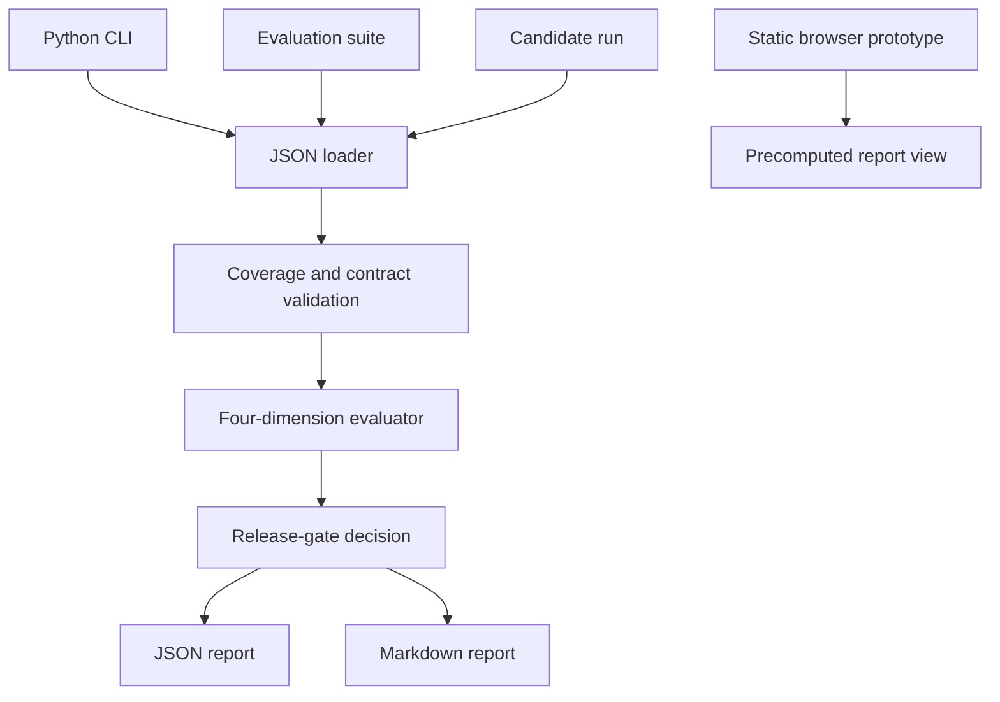

# System Architecture

## v0.1 design goals

- deterministic and reproducible evaluation;
- no paid runtime dependency;
- explainable dimensions and release decisions;
- synthetic public evidence only;
- clear separation between rules and semantic judgment.

## Logical architecture

## Component responsibilities

| Component | Responsibility |
| --- | --- |
| `evaluator.py` | Validate IDs, score cases, apply the gate and serialize reports. |
| `cli.py` | Provide file input and report-output arguments. |
| `data/` | Store the synthetic suite and candidate run. |
| `reports/` | Preserve reproducible public evaluation evidence. |
| `site/` | Explain the report without a server or model call. |

## Future production architecture

A later service may add authenticated project storage, job execution, provider adapters, baseline comparisons, reviewer annotations, cost/latency telemetry and audit events. Those concerns remain outside v0.1 so the first repository stays inspectable.
